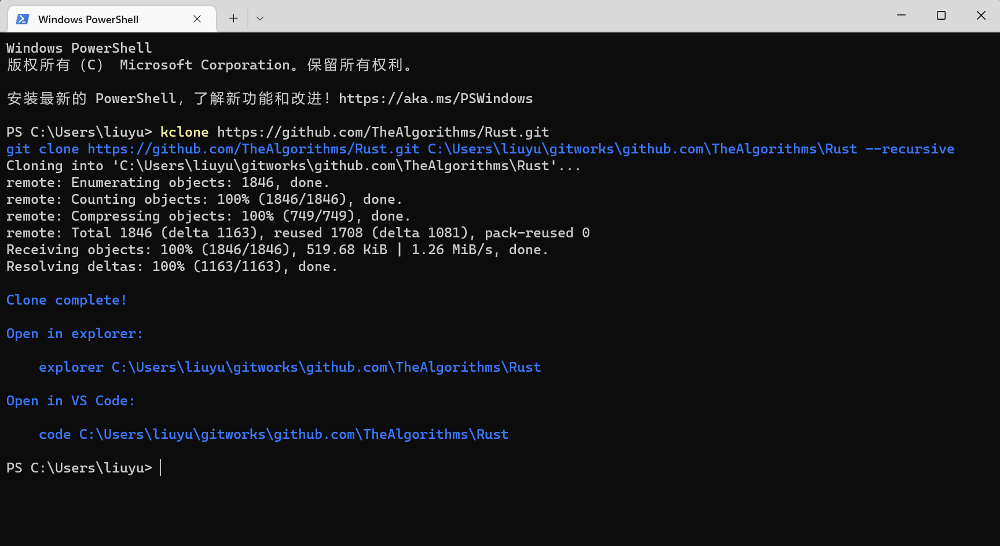
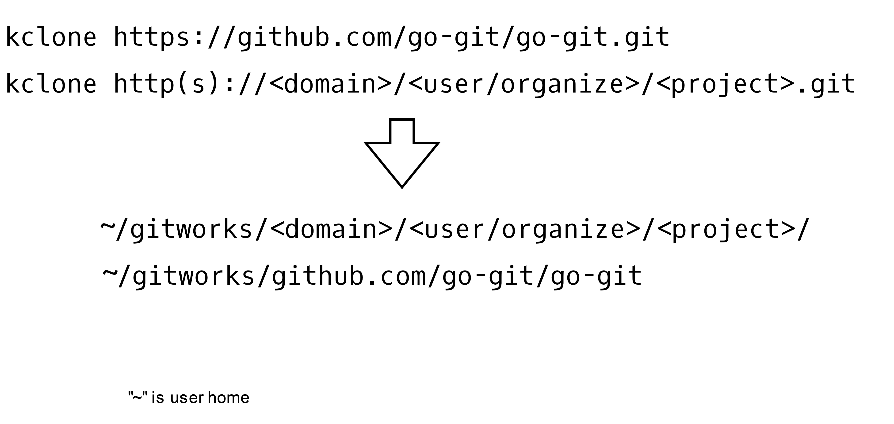

# kclone

git clone for me, unified git clone path

```text
http(s)://<domain>/<user/organize>/<project>.git
```

clone to

```text
~/gitworks/<domain>/<user/organize>/<project>/
```



## Usage

```text
kclone <url>
```

## Example

```bash
kclone https://github.com/go-git/go-git.git
```

This repository will be cloned to

```bash
~/gitworks/github.com/go-git/go-git
```


